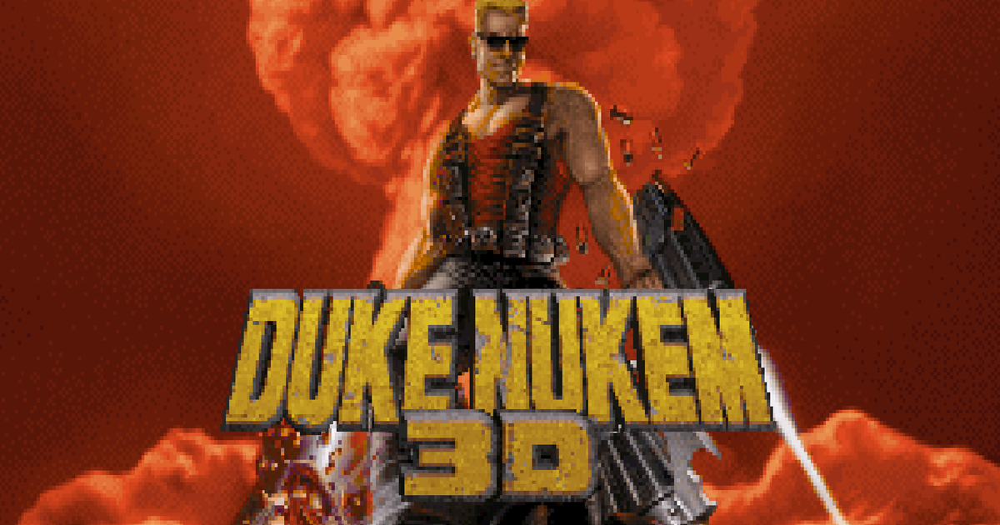

# EDuke32-WASM

Duke Nukem 3D on WebAssembly, with serverless peer-to-peer multiplayer.

[](https://digitalcybersoft.github.io/eduke32-wasm/)

### [▶ PLAY NOW — digitalcybersoft.github.io/eduke32-wasm](https://digitalcybersoft.github.io/eduke32-wasm/)

No install, no account — the shareware episode is bundled and multiplayer
works straight from the page.

This is a downstream fork. The game engine is **[EDuke32](https://www.eduke32.com/)**,
the long-running open-source Duke Nukem 3D port — all engine, renderer, and
gameplay credit belongs to the EDuke32 team and the lineage it builds on:
Ken Silverman's BUILD engine, Jonathon Fowler's JFDuke3D, 3D Realms' original
Duke Nukem 3D, and StrikerTheHedgefox's NetDuke32, whose lockstep multiplayer
revival is the foundation this fork's netcode grew from. This repository
changes none of what makes the game the game; it adds the two things below.

## 1. It runs in your browser

The full EDuke32 engine compiled to WebAssembly with Emscripten — no install,
no plugins, playable immediately with the bundled shareware episode:

- Classic Build renderer, sound, and music in a canvas; the engine's blocking
  main loop runs under ASYNCIFY so menus, loads, and network waits never
  freeze the tab.
- Saves, settings, and game data persist locally (IndexedDB / localStorage).
  Import your own retail `DUKE3D.GRP` once through the settings panel and the
  full game lives in your browser.
- A web shell tuned for actually playing an FPS in a tab: one-click
  fullscreen with the Keyboard Lock API (holding Ctrl to crouch and tapping W
  no longer closes the tab), a leave-confirmation that only arms during live
  play, display modes, a mute toggle, and crash forensics that survive a dead
  tab to make bug reports useful.

## 2. Multiplayer, rebuilt for the open web

NetDuke32 proved classic lockstep netplay could live again; this fork extends
that work into a serverless, browser-native model:

- **No servers.** Players connect directly over WebRTC data channels. Public
  Nostr relays carry only signaling and match discovery — there is no game
  server, no accounts, nothing to host or pay for.
- **Host-authoritative streaming.** Instead of pure lockstep, the host
  continuously streams authoritative world state (enemy health and deaths,
  doors, walls, pickups, positions) while guests run a responsive free-run
  local simulation with client-side prediction. Guest input lag no longer
  scales with ping, and world truth is always the host's: enemy kills are
  host-owned, so desync artifacts like "the corpse that keeps shooting"
  self-heal instead of accumulating.
- **Cross-play.** A native Linux build speaks the identical transport and
  wire protocol, so browser players and native players share matches freely —
  either side can host.
- **Mid-game joins.** Join a running deathmatch or co-op: the host streams a
  state snapshot, a reliable catch-up handshake paces you to the live edge,
  and you're seated deterministically on every peer's timeline. Snapshots are
  serialized portably, so a 64-bit native host and a 32-bit browser guest
  exchange them byte-for-byte.
- **Explicit level-transition gating.** The host alone signals "load the next
  level" and "enter now"; everyone else holds at a lobby-style wait screen
  with a per-player Ready/Loading roster. Nobody enters a level while someone
  is still loading textures.
- **Resilient connections.** Offer/answer generation tracking, dead-peer
  reaping, disconnect grace windows (45 s in-game, 120 s across level loads),
  and in-order GRP transfer with resume — matches survive the hiccups real
  links have.
- **Game data handled honestly.** GRPs are fingerprinted (CRC-32 + SHA-256)
  and matched between peers; the freely distributable shareware episode can
  be transferred player-to-player so a friend can join in one click, while
  retail data is never redistributed.
- **Lobbies.** Host public matches (discoverable in the in-page browser) or
  private ones via invite codes and `?join=` links.

## Game data

No retail assets are included. The **shareware 1.3d episode** is freely
distributable (`assets/shareware/LICENSE.TXT`) and every build ships playable
out of the box:

- **Web**: shareware is baked into the engine bundle.
- **Native releases** (Linux/macOS/Windows): the shareware `DUKE3D.GRP` is
  packaged beside the binary.
- **Bare/self-built native binaries**: on first launch with no game data
  found, the engine downloads the shareware GRP (11 MB) next to itself and
  boots it — the download is checksum-pinned against the engine's known
  shareware fingerprint, so a bad or tampered file is discarded.

For the full game, use the `DUKE3D.GRP` from a copy you own (GOG, Steam,
original CD): drop it beside the binary (native) or import it once through
the settings panel (web — it stays in browser storage, local to you). Retail
data always wins the group selection over shareware.

## Building

Native Linux (cross-play host/guest):

```sh
make NETNATIVE=1 NETDUKE32=1 USE_LIBVPX=0 RENDERTYPE=SDL SDL_TARGET=2 obj=obj-native -j8
```

WebAssembly engine:

```sh
source /path/to/emsdk/emsdk_env.sh
make PLATFORM=EMSCRIPTEN EM_SINGLE_FILE=0 NETDUKE32=1 obj=obj-em -j8
```

Web networking bundle, then serve `platform/emscripten/index.html` with the
engine artifacts from any static HTTPS server:

```sh
cd platform/emscripten && npm install && npm run build:net
```

## Headless / testing knobs (native)

| Variable | Meaning |
| --- | --- |
| `NN_ROLE` | `host` or `guest` (auto-start without the menu) |
| `NN_KEY` | shared match key |
| `NN_HOSTID` | host identity for a guest to join |
| `NN_PLAYERS` | seats to wait for before launching (default 2) |
| `NN_MAXPLAYERS` | seat cap, decoupled from the launch threshold; honored up to 16 (the native transport defaults to 8). Caveat: host uplink scales O(N) -- 16 seats is ~4x the 8-player uplink; browser hosts on residential links should stay near 8 |
| `NN_PUBLIC` | `1` = announce in the public match list |
| `NN_NAME` | match / player name |
| `NN_GAMETYPE` | gametype index: `0` deathmatch (default), `1` co-op, `2` DM no-spawn, `3`/`4` team DM, `5` last man standing, `6` co-op no-respawn |
| `NN_LOCALBOT` | `1` = this seat plays itself (test bot) |
| `NN_BOTLTG` | bot roaming brain (OpenArena-mined two-tier goals: map-wide committed goal + last-seen chase + per-edge avoid-reach). Default ON; `0` = kill-switch back to the old single-room brain (also the baseline leg of the roaming smoke) |
| `NN_AUTOAIM` | host: `1` = allow autoaim; default forces it OFF for every player |
| `NN_FORENSICS` | `1` = verbose net forensics logging (`[psnd]`, dumps, probes) |
| `NN_PREDICT` | prediction feature mask; default all ON, `0` = kill-switch. bit0 correction replay, bit1 predicted view, bit2 reserved (P3 weapon visuals), bit3 instant local action sounds, bit4 idle correction deadband (standstill-flash fix) |

## More documentation

- `platform/emscripten/README-netplay.md` — the browser transport in depth
  (WebRTC channels, Nostr signaling, GRP gating/transfer, the JS↔C seam).
- `platform/emscripten/docs/` — integration notes and menu specs.

## Credit where it's due

This fork is a thin layer on decades of other people's work:

- **[EDuke32](https://www.eduke32.com/)** — the engine itself: the EDuke32
  team's port, renderer, scripting, and years of maintenance. GPL-2.0
  (`source/duke3d/gpl-2.0.txt`) plus the BUILD license
  (`source/build/buildlic.txt`).
- **NetDuke32** (StrikerTheHedgefox) — the revived classic lockstep netcode
  this fork's multiplayer started from.
- **BUILD engine** — Ken Silverman.
- **JFDuke3D** — Jonathon Fowler's foundational source port.
- **Duke Nukem 3D** — 3D Realms. The game, its name, and its retail assets
  remain the property of their copyright holders and are not included here.
